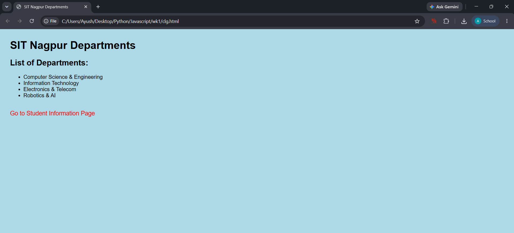
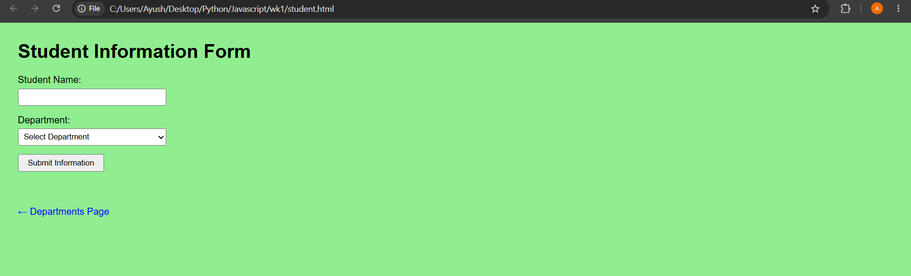

**Experiment/ Case Study No.:**1
**1. Experiment Title:** Demonstration of Inline, Internal and External JavaScript, Console Methods and Uses Information Webpage

**2. Software/Tools Required:** VS Code, Web Browser, HTML, CSS, JavaScript
**3. Experiment Program Code:** 


### `int_ex_inline_js.html`
```html
<html>

<head>

    <form id="detailsForm">
        <label for="name">Name:</label>
        <input type="text" id="name" required>
        <br><br>

        <label for="age">Age:</label>
        <input type="number" id="age" required>
        <br><br>

        <button type="submit">Submit</button>
    </form>

    <div id="result"></div>

    <script>
        function showwelcome() {
            let name = document.getElementsByID("name").value;
            let age = document.getElementsByID("age").value;

            //display welcome msg
            document.getElementById("output").innerHTML = "<h2> welcome" + name + "!</h2>" + "<p> Your age " + age + "</p>";

            console.log("name: " + name);
            console.info("age: " + age);
            console.warn("warn msg");
            console.error("error msg");
        }

    </script>
</head>

</body>

<h1>User Info</h1>
<label>
    enter name:
</label><br>
<input type="text" id="name" placeholder="" enter name><br><br>
<label>
    enter age:
</label><br>
<input type="number" id="age" placeholder="" enter age><br><br>
<button onclick="showwelcome(); greet();">submit</button>

<hr>
<div id="output"></div>
<!-- External Javascript -->
<script src="script.js"></script>
</body>

</html>
```

**4. Output:**

**5. Case Study Title:** Making of a Student Information Webpage Connected to the SIT Nagpur Department Webpage using JavaScript

**6. Case Study Program Code:** 
### `script.js`
```javascript
function welcomeAlert() {
    alert("welcome sit nagpur ");
}
```

### `student.html`
```html
<html>

<head>
    <title>Student Page</title>
    <style>
        body {
            font-family: Arial, sans-serif;
            background-color: lightgreen;
            margin: 30px;
        }

        input,
        select {
            display: block;
            margin: 5px 0 15px 0;
            padding: 5px;
            width: 250px;
        }

        button {
            padding: 5px 15px;
            cursor: pointer;
        }

        #output {
            margin-top: 20px;
        }

        a {
            display: inline-block;
            margin-top: 20px;
            color: blue;
            text-decoration: none;
        }
    </style>
</head>

<body>

    <h1>Student Information Form</h1>

    <form id="studentForm" onsubmit="showStudentInfo(event)">
        <label>Student Name:</label>
        <input type="text" id="studentName" required>

        <label>Department:</label>
        <select id="dept" required>
            <option value="">Select Department</option>
            <option value="Computer Science">Computer Science & Eng.</option>
            <option value="Information Technology">Information Technology</option>
            <option value="Electronics">Electronics</option>
            <option value="Robotics">Robotics & AI</option>
        </select>

        <button type="submit">Submit Information</button>
    </form>

    <div id="output"></div>

    <br>
    <a href="clg.html">&larr; Departments Page</a>

    <script>
        function showStudentInfo(event) {
            event.preventDefault();
            let name = document.getElementById("studentName").value;
            let dept = document.getElementById("dept").value;
            let outputDiv = document.getElementById("output");
            outputDiv.innerHTML = "<h3>Submitted Details:</h3>" +
                "<p><b>Name:</b> " + name + "</p>" +
                "<p><b>Department:</b> " + dept + "</p>";
            console.log("studentName:", name);
            console.info("dept:", dept);
            console.warn("warn msg");
            console.error("error msg");

            welcomeAlert();
        }
    </script>
    <script src="script.js"></script>
</body>

</html>
### `clg.html`
```html
<!DOCTYPE html>
<html>

<head>
    <title>SIT Nagpur Departments</title>
    <style>
        body {
            font-family: Arial, sans-serif;
            background-color: lightblue;
            margin: 30px;
        }

        a {
            color: red;
            text-decoration: none;
            font-size: 18px;
        }

        a:hover {
            text-decoration: underline;
        }
    </style>
</head>

<body>

    <h1>SIT Nagpur Departments</h1>

    <h2>List of Departments:</h2>
    <ul>
        <li>Computer Science & Engineering</li>
        <li>Information Technology</li>
        <li>Electronics & Telecom</li>
        <li>Robotics & AI</li>
    </ul>

    <br>
    <a href="student.html">Go to Student Information Page</a>

</body>

</html>
```
**7. Output:**


**8. Result/Conclusion:**
The practical was performed successfully. Different methods of JavaScript — Internal, Inline, and External — were demonstrated along with all major console methods (console.log, console.error, console.warn, console.info, console.table, console.time). A student information webpage connected to the SIT Nagpur department page was created successfully.


