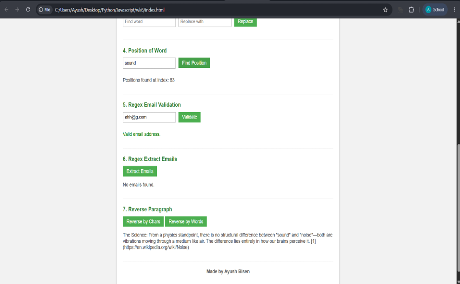

**Experiment/ Case Study No.:** 6
**1. Experiment Title:** 

**2. Software/Tools Required:** VS Code, Web Browser, HTML, CSS, JavaScript
**3. Experiment Program Code:** 

### `index.html`
```html
<!DOCTYPE html>
<html lang="en">
<head>
    <meta charset="UTF-8">
    <meta name="viewport" content="width=device-width, initial-scale=1.0">
    <title>Week 6 Text Processing</title>
    <link rel="stylesheet" href="style.css">
</head>
<body>
    <div class="container">
        
        <label for="userPara"><strong>Input Paragraph:</strong></label><br>
        <textarea id="userPara" rows="5" placeholder="Enter paragraph here..."></textarea><br>
        <button id="btnSubmitPara" style="margin-bottom: 20px;">Submit</button>
        
        <div class="section">
            <h3>1. Original Paragraph</h3>
            <button id="btnShowOriginal">Show Original</button>
            <div id="out-tool-1" class="output"></div>
        </div>

        <div class="section">
            <h3>2. Vowels</h3>
            <button id="btnFindVowels">Find Vowels</button>
            <div id="out-tool-2" class="output"></div>
        </div>

        <div class="section">
            <h3>3. Replace Word</h3>
            <input type="text" id="findWordInput" placeholder="Find word">
            <input type="text" id="replaceWordInput" placeholder="Replace with">
            <button id="btnReplaceWord">Replace</button>
            <div id="out-tool-3" class="output"></div>
        </div>

        <div class="section">
            <h3>4. Position of Word</h3>
            <input type="text" id="posWordInput" placeholder="Search word">
            <button id="btnFindPosition">Find Position</button>
            <div id="out-tool-4" class="output"></div>
        </div>

        <div class="section">
            <h3>5. Regex Email Validation</h3>
            <input type="text" id="emailValInput" placeholder="Enter email">
            <button id="btnValidateEmail">Validate</button>
            <div id="out-tool-5" class="output"></div>
        </div>

        <div class="section">
            <h3>6. Regex Extract Emails</h3>
            <button id="btnExtractEmails">Extract Emails</button>
            <div id="out-tool-6" class="output"></div>
        </div>

        <div class="section">
            <h3>7. Reverse Paragraph</h3>
            <button id="btnReverseChars">Reverse by Chars</button>
            <button id="btnReverseWords">Reverse by Words</button>
            <div id="out-tool-7" class="output"></div>
        </div>

        <footer>
            <p>Made by Ayush Bisen</p>
        </footer>
    </div>

    <script src="script.js"></script>
</body>
</html>

```

### `script.js`
```javascript
document.addEventListener('DOMContentLoaded', () => {
    const userParaInput = document.getElementById('userPara');
    
    // Outputs
    const out1 = document.getElementById('out-tool-1');
    const out2 = document.getElementById('out-tool-2');
    const out3 = document.getElementById('out-tool-3');
    const out4 = document.getElementById('out-tool-4');
    const out5 = document.getElementById('out-tool-5');
    const out6 = document.getElementById('out-tool-6');
    const out7 = document.getElementById('out-tool-7');

    let initialParagraph = "";

    // Save initial paragraph on submit button click
    document.getElementById('btnSubmitPara').addEventListener('click', () => {
        initialParagraph = userParaInput.value;
        alert("Paragraph submitted!");
    });

    // Helper: Escape HTML
    function escapeHtml(str) {
        return str.replace(/[&<>"']/g, function(m) {
            return {
                '&': '&amp;',
                '<': '&lt;',
                '>': '&gt;',
                '"': '&quot;',
                "'": '&#039;'
            }[m];
        });
    }

    // 1. Original Paragraph
    document.getElementById('btnShowOriginal').addEventListener('click', () => {
        if (initialParagraph) {
            out1.innerHTML = `<p>${escapeHtml(initialParagraph)}</p>`;
        } else {
            out1.innerHTML = "<p>No original text submitted yet.</p>";
        }
    });

    // 2. Vowels
    document.getElementById('btnFindVowels').addEventListener('click', () => {
        const text = userParaInput.value;
        if (!text) {
            out2.innerHTML = "<p>Please enter text.</p>";
            return;
        }

        let total = 0;
        const counts = { a: 0, e: 0, i: 0, o: 0, u: 0 };
        let highlighted = "";

        for (let char of text) {
            let lower = char.toLowerCase();
            if (['a', 'e', 'i', 'o', 'u'].includes(lower)) {
                counts[lower]++;
                total++;
                highlighted += `<span class="highlight">${escapeHtml(char)}</span>`;
            } else {
                highlighted += escapeHtml(char);
            }
        }

        out2.innerHTML = `
            <p>Total Vowels: ${total}</p>
            <p>A: ${counts.a}, E: ${counts.e}, I: ${counts.i}, O: ${counts.o}, U: ${counts.u}</p>
            <p>${highlighted}</p>
        `;
    });

    // 3. Replace Word
    document.getElementById('btnReplaceWord').addEventListener('click', () => {
        const text = userParaInput.value;
        const find = document.getElementById('findWordInput').value;
        const replace = document.getElementById('replaceWordInput').value;

        if (!text || !find) {
            out3.innerHTML = "<p>Please enter paragraph and word to find.</p>";
            return;
        }

        const regex = new RegExp(find.replace(/[.*+?^${}()|[\]\\]/g, '\\$&'), 'gi');
        const matches = text.match(regex);
        const count = matches ? matches.length : 0;
        const newText = text.replace(regex, `<span class="highlight">${escapeHtml(replace)}</span>`);

        out3.innerHTML = `
            <p>Replacements made: ${count}</p>
            <p>${newText}</p>
        `;
    });

    // 4. Position of Word
    document.getElementById('btnFindPosition').addEventListener('click', () => {
        const text = userParaInput.value;
        const word = document.getElementById('posWordInput').value;

        if (!text || !word) {
            out4.innerHTML = "<p>Please enter paragraph and search word.</p>";
            return;
        }

        let pos = text.toLowerCase().indexOf(word.toLowerCase());
        const positions = [];
        while (pos !== -1) {
            positions.push(pos);
            pos = text.toLowerCase().indexOf(word.toLowerCase(), pos + 1);
        }

        out4.innerHTML = `
            <p>Positions found at index: ${positions.length > 0 ? positions.join(', ') : 'None'}</p>
        `;
    });

    // 5. Regex Email Validation
    document.getElementById('btnValidateEmail').addEventListener('click', () => {
        const email = document.getElementById('emailValInput').value;
        const regex = /^[a-zA-Z0-9._%+-]+@[a-zA-Z0-9.-]+\.[a-zA-Z]{2,}$/;

        if (regex.test(email)) {
            out5.innerHTML = `<p style="color: green;">Valid email address.</p>`;
        } else {
            out5.innerHTML = `<p style="color: red;">Invalid email address.</p>`;
        }
    });

    // 6. Regex Extract Emails
    document.getElementById('btnExtractEmails').addEventListener('click', () => {
        const text = userParaInput.value;
        const regex = /[a-zA-Z0-9._%+-]+@[a-zA-Z0-9.-]+\.[a-zA-Z]{2,}/gi;
        const matches = text.match(regex);

        if (matches) {
            const unique = [...new Set(matches)];
            out6.innerHTML = `<p>Found: ${unique.join(', ')}</p>`;
        } else {
            out6.innerHTML = `<p>No emails found.</p>`;
        }
    });

    // 7. Reverse Paragraph
    document.getElementById('btnReverseChars').addEventListener('click', () => {
        const text = userParaInput.value;
        out7.innerHTML = `<p>${escapeHtml(text.split('').reverse().join(''))}</p>`;
    });

    document.getElementById('btnReverseWords').addEventListener('click', () => {
        const text = userParaInput.value;
        out7.innerHTML = `<p>${escapeHtml(text.split(/\\s+/).reverse().join(' '))}</p>`;
    });
});

```

### `style.css`
```css
body {
    font-family: Arial, sans-serif;
    background-color: #f2f2f2;
    color: #333;
    padding: 20px;
}

.container {
    max-width: 700px;
    margin: 0 auto;
    background: #fff;
    padding: 20px;
    border: 1px solid #ccc;
    box-shadow: 0 0 5px rgba(0,0,0,0.1);
}

textarea {
    width: 100%;
    margin-bottom: 20px;
    padding: 10px;
    font-family: Arial, sans-serif;
    box-sizing: border-box;
}

.section {
    margin-bottom: 20px;
    padding-bottom: 15px;
    border-bottom: 1px solid #eee;
}

h3 {
    margin-top: 0;
    margin-bottom: 10px;
    font-size: 16px;
    color: #2e7d32; /* Simple green color */
}

input[type="text"] {
    padding: 5px;
    margin-right: 5px;
    margin-bottom: 10px;
}

button {
    padding: 6px 12px;
    background-color: #4CAF50;
    color: white;
    border: none;
    cursor: pointer;
    font-size: 14px;
}

button:hover {
    background-color: #45a049;
}

.output {
    margin-top: 10px;
    font-size: 14px;
    color: #444;
    word-break: break-word;
}

.highlight {
    background-color: #c8e6c9;
    color: #1b5e20;
    font-weight: bold;
    padding: 0 2px;
}

footer {
    text-align: center;
    margin-top: 20px;
    font-size: 14px;
    color: #666;
    font-weight: bold;
}

```

**4. Output:**


**5. Case Study Title:** 

**6. Case Study Program Code:**

### `case_study.html`
```html
<!DOCTYPE html>
<html lang="en">
<head>
    <meta charset="UTF-8">
    <meta name="viewport" content="width=device-width, initial-scale=1.0">
    <title>Week 6 Case Study</title>
    <link rel="stylesheet" href="case_study.css">
</head>
<body>
    <div class="container">
        <header>
            <h1>Week 6 Case Study: Text Processing</h1>
        </header>
        
        <section class="case-study">
            <h2>Overview</h2>
            <p>In Week 6, we focused on Javascript string manipulation, regular expressions, and event handling. We built a text processing tool that can count vowels, find and replace words, search for word positions, validate and extract emails using Regex, and reverse paragraphs.</p>
            <p>This case study highlights the importance of string methods like <code>indexOf</code>, <code>match</code>, <code>replace</code>, and <code>split</code>/<code>reverse</code>/<code>join</code> for handling user input efficiently.</p>
        </section>

        <section class="programs">
            <h2>Interactive Programs</h2>
            <label for="inputText"><strong>Input Text:</strong></label><br>
            <textarea id="inputText" rows="5" placeholder="Enter your string or paragraph here..."></textarea><br>
            
            <div class="tool-section">
                <h3>1. Reverse a String</h3>
                <button id="btnReverseString">Reverse String</button>
                <div id="outReverse" class="output"></div>
            </div>

            <div class="tool-section">
                <h3>2. Count Vowels in Paragraph</h3>
                <button id="btnCountVowels">Count Vowels</button>
                <div id="outVowels" class="output"></div>
            </div>
        </section>

        <footer>
            <p>Made by Ayush Bisen</p>
        </footer>
    </div>
    <script src="case_study.js"></script>
</body>
</html>

```

### `case_study.js`
```javascript
document.addEventListener('DOMContentLoaded', () => {
    const inputTextArea = document.getElementById('inputText');
    const outReverse = document.getElementById('outReverse');
    const outVowels = document.getElementById('outVowels');

    // Helper to escape HTML
    function escapeHtml(str) {
        return str.replace(/[&<>"']/g, function(m) {
            return {
                '&': '&amp;',
                '<': '&lt;',
                '>': '&gt;',
                '"': '&quot;',
                "'": '&#039;'
            }[m];
        });
    }

    // 1. Program to Reverse a String
    document.getElementById('btnReverseString').addEventListener('click', () => {
        const text = inputTextArea.value;
        if (!text) {
            outReverse.innerHTML = "<p style='color: red;'>Please enter some text.</p>";
            return;
        }
        
        // Reversing string
        const reversed = text.split('').reverse().join('');
        outReverse.innerHTML = `<p><strong>Reversed String:</strong> <br>${escapeHtml(reversed)}</p>`;
    });

    // 2. WAP to count number of vowels in a paragraph
    document.getElementById('btnCountVowels').addEventListener('click', () => {
        const text = inputTextArea.value;
        if (!text) {
            outVowels.innerHTML = "<p style='color: red;'>Please enter a paragraph.</p>";
            return;
        }

        let totalVowels = 0;
        const counts = { a: 0, e: 0, i: 0, o: 0, u: 0 };
        let highlightedText = "";

        for (let char of text) {
            let lower = char.toLowerCase();
            if (['a', 'e', 'i', 'o', 'u'].includes(lower)) {
                counts[lower]++;
                totalVowels++;
                highlightedText += `<span class="highlight">${escapeHtml(char)}</span>`;
            } else {
                highlightedText += escapeHtml(char);
            }
        }

        outVowels.innerHTML = `
            <p><strong>Total Vowels Found:</strong> ${totalVowels}</p>
            <ul>
                <li>A: ${counts.a}</li>
                <li>E: ${counts.e}</li>
                <li>I: ${counts.i}</li>
                <li>O: ${counts.o}</li>
                <li>U: ${counts.u}</li>
            </ul>
            <p><strong>Paragraph with vowels highlighted:</strong><br> ${highlightedText}</p>
        `;
    });
});

```

### `case_study.css`
```css
body {
    font-family: Arial, sans-serif;
    background-color: #f2f2f2;
    color: #333;
    padding: 20px;
}

.container {
    max-width: 800px;
    margin: 0 auto;
    background: #fff;
    padding: 20px;
    border: 1px solid #ccc;
}

h1, h2, h3 {
    color: #2e7d32;
}

textarea {
    width: 100%;
    margin-bottom: 20px;
    padding: 5px;
    font-family: Arial, sans-serif;
    box-sizing: border-box;
}

.tool-section {
    margin-bottom: 20px;
    padding: 10px;
    border: 1px solid #ccc; /* Removed the green strip and background */
}

button {
    padding: 5px 10px;
    background-color: #4CAF50;
    color: white;
    border: 1px solid #2e7d32;
    cursor: pointer;
}

.output {
    margin-top: 10px;
    padding: 5px;
    border: 1px dashed #ccc;
    background-color: #f9f9f9;
}

.highlight {
    background-color: #c8e6c9;
    font-weight: bold;
}

footer {
    text-align: center;
    margin-top: 20px;
    font-size: 14px;
}

```

**7. Output:**


**8. Result/Conclusion:**
The experiment successfully demonstrated text processing using JavaScript string manipulation and regular expressions. Features like counting vowels, replacing words, finding word positions, validating and extracting emails, and reversing strings were implemented. The case study further reinforced these concepts by providing an interactive tool to count vowels and reverse strings dynamically. The application effectively handles user input and manipulates the DOM to display results seamlessly.
