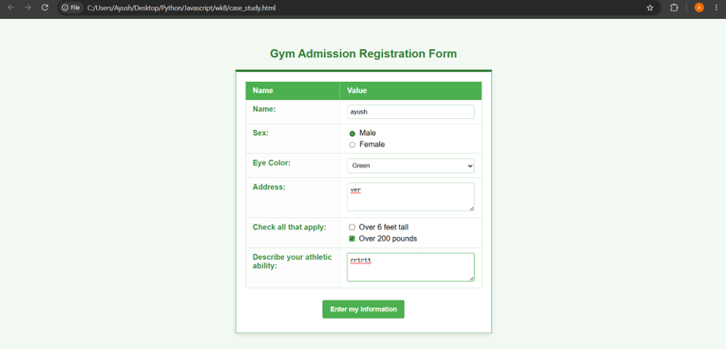
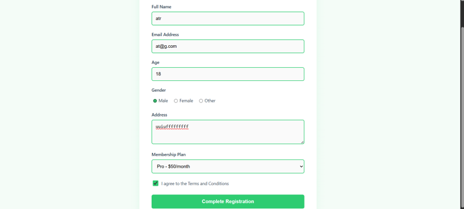

**Experiment/ Case Study No.:** 8
**1. Experiment Title:** Access and validate form fields using events.

**2. Software/Tools Required:** VS Code, Web Browser, HTML, CSS, JavaScript
**3. Experiment Program Code:** 

### `index.html`
```html
<!DOCTYPE html>
<html lang="en">
<head>
    <meta charset="UTF-8">
    <meta name="viewport" content="width=device-width, initial-scale=1.0">
    <title>Gym Admission Form</title>
    <link rel="stylesheet" href="style.css">
</head>
<body>
    <div class="form-container">
        <h1>Gym Admission</h1>
        <form id="gymForm">
            <div class="form-group">
                <label for="fullName">Full Name</label>
                <input type="text" id="fullName" name="fullName" placeholder="Enter your full name">
                <span class="error-message" id="nameError"></span>
            </div>
            
            <div class="form-group">
                <label for="email">Email Address</label>
                <input type="email" id="email" name="email" placeholder="Enter your email">
                <span class="error-message" id="emailError"></span>
            </div>

            <div class="form-group">
                <label for="phone">Phone Number</label>
                <input type="text" id="phone" name="phone" placeholder="Enter your phone number (10 digits)">
                <span class="error-message" id="phoneError"></span>
            </div>

            <div class="form-group">
                <label for="plan">Membership Plan</label>
                <select id="plan" name="plan">
                    <option value="">-- Select a plan --</option>
                    <option value="basic">Basic (1 Month)</option>
                    <option value="pro">Pro (6 Months)</option>
                    <option value="premium">Premium (1 Year)</option>
                </select>
                <span class="error-message" id="planError"></span>
            </div>

            <button type="submit" id="submitBtn">Join Now</button>
        </form>
        <div id="successMessage" class="hidden">
            🎉 Welcome to the Gym! Your registration is successful.
        </div>
    </div>
    <script src="script.js"></script>
</body>
</html>

```

### `script.js`
```javascript
document.addEventListener('DOMContentLoaded', () => {
    const form = document.getElementById('gymForm');
    const fullName = document.getElementById('fullName');
    const email = document.getElementById('email');
    const phone = document.getElementById('phone');
    const plan = document.getElementById('plan');
    const successMessage = document.getElementById('successMessage');

    // 1. Validation Logic
    const validateName = () => {
        const value = fullName.value.trim();
        const errorSpan = document.getElementById('nameError');
        if (value.length < 3) {
            showError(fullName, errorSpan, 'Name must be at least 3 characters long');
            return false;
        }
        showSuccess(fullName, errorSpan);
        return true;
    };

    const validateEmail = () => {
        const value = email.value.trim();
        const errorSpan = document.getElementById('emailError');
        const emailPattern = /^[^\s@]+@[^\s@]+\.[^\s@]+$/;
        if (!emailPattern.test(value)) {
            showError(email, errorSpan, 'Please enter a valid email address');
            return false;
        }
        showSuccess(email, errorSpan);
        return true;
    };

    const validatePhone = () => {
        const value = phone.value.trim();
        const errorSpan = document.getElementById('phoneError');
        const phonePattern = /^\d{10}$/; // Exactly 10 digits
        if (!phonePattern.test(value)) {
            showError(phone, errorSpan, 'Phone number must be exactly 10 digits');
            return false;
        }
        showSuccess(phone, errorSpan);
        return true;
    };

    const validatePlan = () => {
        const value = plan.value;
        const errorSpan = document.getElementById('planError');
        if (value === "") {
            showError(plan, errorSpan, 'Please select a membership plan');
            return false;
        }
        showSuccess(plan, errorSpan);
        return true;
    };

    // Helper functions for UI feedback
    const showError = (inputElement, errorElement, message) => {
        inputElement.classList.add('invalid');
        inputElement.classList.remove('valid');
        errorElement.textContent = message;
    };

    const showSuccess = (inputElement, errorElement) => {
        inputElement.classList.add('valid');
        inputElement.classList.remove('invalid');
        errorElement.textContent = '';
    };

    // --- EVENT LISTENERS ---

    // 2. FOCUS EVENTS
    // Highlight or log when user enters a field
    const inputs = [fullName, email, phone, plan];
    inputs.forEach(input => {
        input.addEventListener('focus', (e) => {
            console.log(`User is focused on: ${e.target.name}`);
        });
    });

    // 3. BLUR EVENTS
    // Validate when the user leaves a field
    fullName.addEventListener('blur', validateName);
    email.addEventListener('blur', validateEmail);
    phone.addEventListener('blur', validatePhone);
    plan.addEventListener('blur', validatePlan);

    // 4. LIVE INPUT EVENTS
    // Provide live feedback as they type (only if they already have an error)
    fullName.addEventListener('input', () => {
        if (fullName.classList.contains('invalid')) validateName();
    });
    email.addEventListener('input', () => {
        if (email.classList.contains('invalid')) validateEmail();
    });
    phone.addEventListener('input', () => {
        if (phone.classList.contains('invalid')) validatePhone();
    });
    plan.addEventListener('change', () => {
        if (plan.classList.contains('invalid')) validatePlan();
    });

    // 5. SUBMIT EVENT
    form.addEventListener('submit', (e) => {
        e.preventDefault(); // Prevent page reload
        
        // Validate all fields on submit
        const isNameValid = validateName();
        const isEmailValid = validateEmail();
        const isPhoneValid = validatePhone();
        const isPlanValid = validatePlan();

        // If everything is valid, show success message
        if (isNameValid && isEmailValid && isPhoneValid && isPlanValid) {
            form.classList.add('hidden'); // Hide the form
            successMessage.classList.remove('hidden'); // Show success text
            console.log('Form successfully submitted!');
        } else {
            console.log('Form submission failed due to validation errors.');
        }
    });
});

```

### `style.css`
```css
:root {
    --primary-green: #2ecc71;
    --dark-green: #27ae60;
    --light-green: #e9f7ef;
    --text-color: #2c3e50;
    --error-color: #e74c3c;
    --bg-color: #f4fdf8;
    --border-color: #bdc3c7;
}

body {
    font-family: 'Segoe UI', Tahoma, Geneva, Verdana, sans-serif;
    background-color: var(--bg-color);
    color: var(--text-color);
    display: flex;
    justify-content: center;
    align-items: center;
    height: 100vh;
    margin: 0;
}

.form-container {
    background: white;
    padding: 30px 40px;
    border-radius: 12px;
    box-shadow: 0 10px 25px rgba(46, 204, 113, 0.15);
    width: 100%;
    max-width: 400px;
    border-top: 6px solid var(--primary-green);
}

h1 {
    text-align: center;
    color: var(--dark-green);
    margin-bottom: 25px;
    font-size: 28px;
}

.form-group {
    margin-bottom: 20px;
}

label {
    display: block;
    margin-bottom: 8px;
    font-weight: 600;
    font-size: 14px;
}

input, select {
    width: 100%;
    padding: 12px;
    border: 1px solid var(--border-color);
    border-radius: 6px;
    box-sizing: border-box;
    font-size: 14px;
    transition: all 0.3s ease;
    background-color: #fafafa;
}

/* Focus Event Visualization */
input:focus, select:focus {
    outline: none;
    border-color: var(--primary-green);
    background-color: #fff;
    box-shadow: 0 0 0 3px rgba(46, 204, 113, 0.2);
}

/* Validation States */
input.valid, select.valid {
    border-color: var(--primary-green);
    background-color: var(--light-green);
}

input.invalid, select.invalid {
    border-color: var(--error-color);
    background-color: #fdf2f1;
}

.error-message {
    color: var(--error-color);
    font-size: 12px;
    display: block;
    margin-top: 6px;
    min-height: 16px;
    font-weight: 500;
}

button {
    width: 100%;
    padding: 14px;
    background-color: var(--primary-green);
    color: white;
    border: none;
    border-radius: 6px;
    font-size: 16px;
    font-weight: 700;
    cursor: pointer;
    transition: background-color 0.3s, transform 0.1s;
    margin-top: 10px;
}

button:hover {
    background-color: var(--dark-green);
}

button:active {
    transform: scale(0.98);
}

.hidden {
    display: none !important;
}

#successMessage {
    margin-top: 20px;
    padding: 20px;
    background-color: var(--light-green);
    color: var(--dark-green);
    text-align: center;
    border-radius: 8px;
    border: 2px dashed var(--primary-green);
    font-weight: 600;
    font-size: 18px;
    animation: fadeIn 0.5s;
}

@keyframes fadeIn {
    from { opacity: 0; transform: translateY(-10px); }
    to { opacity: 1; transform: translateY(0); }
}

```

**4. Output:**


**5. Case Study Title:** Design a gym admission form with event-driven validatio.

**6. Case Study Program Code:**

### `gym.html`
```html
<!DOCTYPE html>
<html lang="en">
<head>
    <meta charset="UTF-8">
    <meta name="viewport" content="width=device-width, initial-scale=1.0">
    <title>Gym Admission Form</title>
    <style>
        :root {
            --primary-green: #2ecc71;
            --dark-green: #27ae60;
            --light-green: #e9f7ef;
            --text-dark: #2c3e50;
            --error-red: #e74c3c;
            --bg-color: #f4fcf7;
        }

        body {
            font-family: 'Inter', 'Segoe UI', Tahoma, Geneva, Verdana, sans-serif;
            background-color: var(--bg-color);
            color: var(--text-dark);
            display: flex;
            justify-content: center;
            align-items: center;
            min-height: 100vh;
            margin: 0;
            padding: 20px;
        }

        .form-container {
            background-color: #ffffff;
            padding: 40px;
            border-radius: 12px;
            box-shadow: 0 10px 25px rgba(46, 204, 113, 0.1);
            width: 100%;
            max-width: 500px;
            border-top: 5px solid var(--primary-green);
        }

        .form-container h2 {
            margin-top: 0;
            margin-bottom: 25px;
            color: var(--dark-green);
            text-align: center;
            font-size: 24px;
        }

        .form-group {
            margin-bottom: 20px;
            position: relative;
        }

        .form-group label.main-label {
            display: block;
            margin-bottom: 8px;
            font-weight: 600;
            font-size: 14px;
            transition: color 0.3s;
        }

        .form-control {
            width: 100%;
            padding: 12px;
            border: 2px solid #e0e0e0;
            border-radius: 6px;
            font-size: 15px;
            transition: all 0.3s ease;
            box-sizing: border-box;
            background-color: #fafafa;
        }
        
        textarea.form-control {
            resize: vertical;
            min-height: 80px;
        }

        .form-control:focus {
            outline: none;
            border-color: var(--primary-green);
            background-color: #fff;
            box-shadow: 0 0 0 3px var(--light-green);
        }

        .form-group.success .form-control {
            border-color: var(--primary-green);
        }

        .form-group.error .form-control {
            border-color: var(--error-red);
        }

        .form-group.error label.main-label {
            color: var(--error-red);
        }

        .error-message {
            color: var(--error-red);
            font-size: 12px;
            margin-top: 5px;
            display: none;
            animation: fadeIn 0.3s ease;
        }

        .form-group.error .error-message {
            display: block;
        }

        .radio-group {
            display: flex;
            gap: 15px;
            padding: 8px 0;
        }

        .radio-group label {
            display: flex;
            align-items: center;
            font-weight: normal;
            font-size: 14px;
            cursor: pointer;
        }

        .radio-group input {
            margin-right: 5px;
            accent-color: var(--primary-green);
            cursor: pointer;
        }

        .checkbox-group {
            display: flex;
            align-items: center;
            margin-bottom: 25px;
        }

        .checkbox-group input {
            margin-right: 10px;
            accent-color: var(--primary-green);
            width: 18px;
            height: 18px;
            cursor: pointer;
        }

        .checkbox-group label {
            margin-bottom: 0;
            font-weight: normal;
            font-size: 14px;
            cursor: pointer;
        }

        .btn-submit {
            width: 100%;
            padding: 14px;
            background-color: var(--primary-green);
            color: white;
            border: none;
            border-radius: 6px;
            font-size: 16px;
            font-weight: 600;
            cursor: pointer;
            transition: background-color 0.3s, transform 0.1s;
        }

        .btn-submit:hover {
            background-color: var(--dark-green);
        }

        .btn-submit:active {
            transform: scale(0.98);
        }
        
        .btn-submit:disabled {
            background-color: #a5d6b8;
            cursor: not-allowed;
            transform: none;
        }

        @keyframes fadeIn {
            from { opacity: 0; transform: translateY(-5px); }
            to { opacity: 1; transform: translateY(0); }
        }

        .success-banner {
            display: none;
            background-color: var(--light-green);
            color: var(--dark-green);
            padding: 15px;
            border-radius: 6px;
            margin-bottom: 20px;
            text-align: center;
            font-weight: 600;
            border: 1px solid var(--primary-green);
        }
    </style>
</head>
<body>

    <div class="form-container">
        <h2>Gym Admission Form</h2>
        
        <div class="success-banner" id="successBanner">
            Registration successful! Welcome to the gym.
        </div>

        <form id="gymForm" novalidate>
            <div class="form-group" id="nameGroup">
                <label for="fullName" class="main-label">Full Name</label>
                <input type="text" id="fullName" class="form-control" placeholder="John Doe" autocomplete="off">
                <div class="error-message" id="nameError">Name must be at least 3 characters long.</div>
            </div>

            <div class="form-group" id="emailGroup">
                <label for="email" class="main-label">Email Address</label>
                <input type="email" id="email" class="form-control" placeholder="john@example.com" autocomplete="off">
                <div class="error-message" id="emailError">Please enter a valid email address.</div>
            </div>
            
            <div class="form-group" id="ageGroup">
                <label for="age" class="main-label">Age</label>
                <input type="number" id="age" class="form-control" placeholder="18" min="16" max="100">
                <div class="error-message" id="ageError">You must be at least 16 years old.</div>
            </div>

            <div class="form-group" id="genderGroup">
                <label class="main-label">Gender</label>
                <div class="radio-group">
                    <label><input type="radio" name="gender" value="male"> Male</label>
                    <label><input type="radio" name="gender" value="female"> Female</label>
                    <label><input type="radio" name="gender" value="other"> Other</label>
                </div>
                <div class="error-message" id="genderError">Please select your gender.</div>
            </div>

            <div class="form-group" id="addressGroup">
                <label for="address" class="main-label">Address</label>
                <textarea id="address" class="form-control" placeholder="Enter your full address"></textarea>
                <div class="error-message" id="addressError">Address must be at least 10 characters long.</div>
            </div>

            <div class="form-group" id="planGroup">
                <label for="plan" class="main-label">Membership Plan</label>
                <select id="plan" class="form-control">
                    <option value="" disabled selected>Select a plan...</option>
                    <option value="basic">Basic - $30/month</option>
                    <option value="pro">Pro - $50/month</option>
                    <option value="elite">Elite - $80/month</option>
                </select>
                <div class="error-message" id="planError">Please select a membership plan.</div>
            </div>

            <div class="checkbox-group" id="termsGroup">
                <input type="checkbox" id="terms">
                <label for="terms">I agree to the Terms and Conditions</label>
            </div>
            <div class="error-message" id="termsError" style="margin-top: -15px; margin-bottom: 20px;">You must agree to the terms.</div>

            <button type="submit" class="btn-submit" id="submitBtn">Complete Registration</button>
        </form>
    </div>

    <script>
        document.addEventListener('DOMContentLoaded', () => {
            const form = document.getElementById('gymForm');
            const fullName = document.getElementById('fullName');
            const email = document.getElementById('email');
            const age = document.getElementById('age');
            const address = document.getElementById('address');
            const plan = document.getElementById('plan');
            const terms = document.getElementById('terms');
            const genderRadios = document.querySelectorAll('input[name="gender"]');
            const successBanner = document.getElementById('successBanner');
            
            // Validation functions
            const validateName = () => {
                const isValid = fullName.value.trim().length >= 3;
                setFieldState(fullName, isValid, 'nameGroup');
                return isValid;
            };

            const validateEmail = () => {
                const emailRegex = /^[^\s@]+@[^\s@]+\.[^\s@]+$/;
                const isValid = emailRegex.test(email.value.trim());
                setFieldState(email, isValid, 'emailGroup');
                return isValid;
            };
            
            const validateAge = () => {
                const val = parseInt(age.value);
                const isValid = !isNaN(val) && val >= 16 && val <= 100;
                setFieldState(age, isValid, 'ageGroup');
                return isValid;
            };

            const validateGender = () => {
                const isSelected = Array.from(genderRadios).some(radio => radio.checked);
                const group = document.getElementById('genderGroup');
                if (isSelected) {
                    group.classList.remove('error');
                    group.classList.add('success');
                } else {
                    group.classList.remove('success');
                    group.classList.add('error');
                }
                return isSelected;
            };

            const validateAddress = () => {
                const isValid = address.value.trim().length >= 10;
                setFieldState(address, isValid, 'addressGroup');
                return isValid;
            };

            const validatePlan = () => {
                const isValid = plan.value !== '';
                setFieldState(plan, isValid, 'planGroup');
                return isValid;
            };

            const validateTerms = () => {
                const isValid = terms.checked;
                const termsError = document.getElementById('termsError');
                if (isValid) {
                    termsError.style.display = 'none';
                } else {
                    termsError.style.display = 'block';
                }
                return isValid;
            };

            // Helper to set visual state
            const setFieldState = (field, isValid, groupId) => {
                const group = document.getElementById(groupId);
                if (field.value.trim() === '' && field.type !== 'select-one') {
                    group.classList.remove('error');
                    group.classList.remove('success');
                } else if (isValid) {
                    group.classList.remove('error');
                    group.classList.add('success');
                } else {
                    group.classList.remove('success');
                    group.classList.add('error');
                }
            };

            // EVENT LISTENERS (Live check, blur, change)
            
            // 1. input / keyup events for live feedback
            fullName.addEventListener('input', validateName);
            email.addEventListener('input', validateEmail);
            age.addEventListener('input', validateAge);
            address.addEventListener('input', validateAddress);

            // 2. blur events for when user leaves a field
            fullName.addEventListener('blur', () => {
                if (fullName.value.trim() === '') {
                    document.getElementById('nameGroup').classList.add('error');
                } else {
                    validateName();
                }
            });
            
            email.addEventListener('blur', () => {
                if (email.value.trim() === '') {
                    document.getElementById('emailGroup').classList.add('error');
                } else {
                    validateEmail();
                }
            });
            
            age.addEventListener('blur', () => {
                if (age.value.trim() === '') {
                    document.getElementById('ageGroup').classList.add('error');
                } else {
                    validateAge();
                }
            });

            address.addEventListener('blur', () => {
                if (address.value.trim() === '') {
                    document.getElementById('addressGroup').classList.add('error');
                } else {
                    validateAddress();
                }
            });

            // 3. change event for select, radio, and checkbox
            plan.addEventListener('change', validatePlan);
            terms.addEventListener('change', validateTerms);
            genderRadios.forEach(radio => {
                radio.addEventListener('change', validateGender);
            });
            
            // 4. focus event (clear errors when starting to type)
            const clearErrorOnFocus = (field, groupId) => {
                field.addEventListener('focus', () => {
                    document.getElementById(groupId).classList.remove('error');
                });
            };
            clearErrorOnFocus(fullName, 'nameGroup');
            clearErrorOnFocus(email, 'emailGroup');
            clearErrorOnFocus(age, 'ageGroup');
            clearErrorOnFocus(address, 'addressGroup');
            clearErrorOnFocus(plan, 'planGroup');

            // 5. submit event
            form.addEventListener('submit', (e) => {
                e.preventDefault(); // Prevent page reload

                // Validate all fields
                const isNameValid = validateName();
                const isEmailValid = validateEmail();
                const isAgeValid = validateAge();
                const isGenderValid = validateGender();
                const isAddressValid = validateAddress();
                const isPlanValid = validatePlan();
                const isTermsValid = validateTerms();

                // Force error display on empty fields
                if (fullName.value.trim() === '') document.getElementById('nameGroup').classList.add('error');
                if (email.value.trim() === '') document.getElementById('emailGroup').classList.add('error');
                if (age.value.trim() === '') document.getElementById('ageGroup').classList.add('error');
                if (address.value.trim() === '') document.getElementById('addressGroup').classList.add('error');

                if (isNameValid && isEmailValid && isAgeValid && isGenderValid && isAddressValid && isPlanValid && isTermsValid) {
                    // Registration success simulation
                    successBanner.style.display = 'block';
                    form.reset();
                    
                    // Clear success styles
                    ['nameGroup', 'emailGroup', 'ageGroup', 'genderGroup', 'addressGroup', 'planGroup'].forEach(id => {
                        document.getElementById(id).classList.remove('success', 'error');
                    });
                    
                    // Hide banner after 5 seconds
                    setTimeout(() => {
                        successBanner.style.display = 'none';
                    }, 5000);
                }
            });
        });
    </script>
</body>
</html>

```

**7. Output:**


**8. Result/Conclusion:**
The experiment successfully demonstrated live DOM analysis and form validation using JavaScript events such as focus, blur, input, change, and submit. The application provides immediate visual feedback on user input for fields like name, email, phone number, and membership plan. The case study reinforced these validation patterns by implementing a more comprehensive gym admission form with live error checking and state management. The project successfully showcases how to build robust, interactive, and user-friendly forms using JavaScript.
