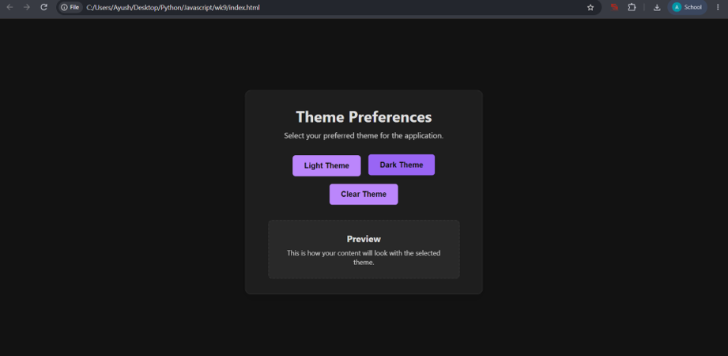
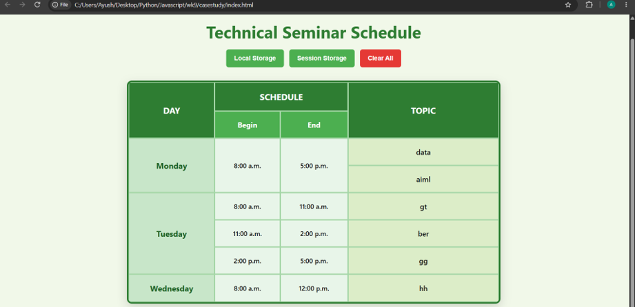

**Experiment/ Case Study No.:** 9
**1. Experiment Title:** Apply local storage and session storage

**2. Software/Tools Required:** VS Code, Web Browser, HTML, CSS, JavaScript
**3. Experiment Program Code:** 

### `index.html`
```html
<!DOCTYPE html>
<html lang="en">
<head>
    <meta charset="UTF-8">
    <meta name="viewport" content="width=device-width, initial-scale=1.0">
    <title>Theme Preference</title>
    <link rel="stylesheet" href="style.css">
</head>
<body>
    <div class="container">
        <h1>Theme Preferences</h1>
        <p>Select your preferred theme for the application.</p>
        
        <div class="theme-buttons">
            <button id="btn-light" class="theme-btn">Light Theme</button>
            <button id="btn-dark" class="theme-btn">Dark Theme</button>
            <button id="btn-clear" class="theme-btn">Clear Theme</button>
        </div>

        <div class="demo-box">
            <h2>Preview</h2>
            <p>This is how your content will look with the selected theme.</p>
        </div>
    </div>
    
    <script src="script.js"></script>
</body>
</html>

```

### `script.js`
```javascript
document.addEventListener('DOMContentLoaded', () => {
    const btnLight = document.getElementById('btn-light');
    const btnDark = document.getElementById('btn-dark');
    const btnClear = document.getElementById('btn-clear');

    // Function to apply a theme
    const applyTheme = (themeName) => {
        if (themeName === 'clear') {
            document.documentElement.removeAttribute('data-theme');
            localStorage.removeItem('preferredTheme');
        } else {
            document.documentElement.setAttribute('data-theme', themeName);
            localStorage.setItem('preferredTheme', themeName);
        }
    };

    // Load saved theme on startup
    const savedTheme = localStorage.getItem('preferredTheme');
    if (savedTheme) {
        applyTheme(savedTheme);
    }

    // Event listeners for buttons
    btnLight.addEventListener('click', () => applyTheme('light'));
    btnDark.addEventListener('click', () => applyTheme('dark'));
    
    // The "Clear" theme restores the default classic green theme
    btnClear.addEventListener('click', () => applyTheme('clear'));
});

```

### `style.css`
```css
/* Base/Clear Theme (Classic Green) */
:root {
    --bg-color: #e8f5e9;
    --text-color: #1b5e20;
    --container-bg: #ffffff;
    --primary-btn: #4caf50;
    --primary-btn-hover: #388e3c;
    --border-color: #a5d6a7;
}

/* Light Theme */
[data-theme="light"] {
    --bg-color: #f5f5f5;
    --text-color: #333333;
    --container-bg: #ffffff;
    --primary-btn: #2196f3;
    --primary-btn-hover: #1976d2;
    --border-color: #e0e0e0;
}

/* Dark Theme */
[data-theme="dark"] {
    --bg-color: #121212;
    --text-color: #e0e0e0;
    --container-bg: #1e1e1e;
    --primary-btn: #bb86fc;
    --primary-btn-hover: #9965f4;
    --border-color: #333333;
}

* {
    margin: 0;
    padding: 0;
    box-sizing: border-box;
    transition: background-color 0.3s ease, color 0.3s ease, border-color 0.3s ease;
}

body {
    font-family: 'Segoe UI', Tahoma, Geneva, Verdana, sans-serif;
    background-color: var(--bg-color);
    color: var(--text-color);
    display: flex;
    justify-content: center;
    align-items: center;
    min-height: 100vh;
}

.container {
    background-color: var(--container-bg);
    padding: 2rem 3rem;
    border-radius: 12px;
    box-shadow: 0 8px 24px rgba(0, 0, 0, 0.1);
    text-align: center;
    max-width: 500px;
    width: 90%;
    border: 1px solid var(--border-color);
}

h1 {
    margin-bottom: 0.5rem;
    font-size: 2rem;
}

p {
    margin-bottom: 2rem;
    opacity: 0.9;
}

.theme-buttons {
    display: flex;
    gap: 1rem;
    justify-content: center;
    margin-bottom: 2rem;
    flex-wrap: wrap;
}

.theme-btn {
    padding: 0.8rem 1.5rem;
    border: none;
    border-radius: 6px;
    background-color: var(--primary-btn);
    color: #ffffff;
    font-weight: 600;
    font-size: 1rem;
    cursor: pointer;
    transition: transform 0.1s ease, background-color 0.2s ease, box-shadow 0.2s ease;
}

[data-theme="dark"] .theme-btn {
    color: #121212;
}

.theme-btn:hover {
    background-color: var(--primary-btn-hover);
    transform: translateY(-2px);
    box-shadow: 0 4px 12px rgba(0, 0, 0, 0.15);
}

.theme-btn:active {
    transform: translateY(0);
}

.demo-box {
    padding: 1.5rem;
    border: 2px dashed var(--border-color);
    border-radius: 8px;
    background-color: rgba(0, 0, 0, 0.02);
}

[data-theme="dark"] .demo-box {
    background-color: rgba(255, 255, 255, 0.05);
}

.demo-box h2 {
    margin-bottom: 0.5rem;
    font-size: 1.2rem;
}

.demo-box p {
    margin-bottom: 0;
    font-size: 0.9rem;
}

```

**4. Output:**


**5. Case Study Title:** Applying a Schedule planner using local storage and session storage.

**6. Case Study Program Code:**

### `casestudy/index.html`
```html
<!DOCTYPE html>
<html lang="en">
<head>
    <meta charset="UTF-8">
    <meta name="viewport" content="width=device-width, initial-scale=1.0">
    <title>Technical Seminar Schedule</title>
    <link rel="stylesheet" href="style.css">
</head>
<body>

    <h1>Technical Seminar Schedule</h1>

    <div class="controls">
        <button id="btn-local" class="btn">Local Storage</button>
        <button id="btn-session" class="btn">Session Storage</button>
        <button id="btn-clear" class="btn btn-clear">Clear All</button>
    </div>

    <table>
        <thead>
            <tr>
                <th rowspan="2" class="main-header">Day</th>
                <th colspan="2" class="main-header">Schedule</th>
                <th rowspan="2" class="main-header">Topic</th>
            </tr>
            <tr>
                <th class="sub-header">Begin</th>
                <th class="sub-header">End</th>
            </tr>
        </thead>
        <tbody>
            <!-- Monday -->
            <tr>
                <td rowspan="2" class="day-cell">Monday</td>
                <td rowspan="2" class="begin-cell">8:00 a.m.</td>
                <td rowspan="2" class="end-cell">5:00 p.m.</td>
                <td class="topic-cell"><input type="text" class="topic-input" data-index="0" placeholder="Type topic..."></td>
            </tr>
            <tr>
                <td class="topic-cell"><input type="text" class="topic-input" data-index="1" placeholder="Type topic..."></td>
            </tr>
            
            <!-- Tuesday -->
            <tr>
                <td rowspan="3" class="day-cell">Tuesday</td>
                <td class="begin-cell">8:00 a.m.</td>
                <td class="end-cell">11:00 a.m.</td>
                <td class="topic-cell"><input type="text" class="topic-input" data-index="2" placeholder="Type topic..."></td>
            </tr>
            <tr>
                <td class="begin-cell">11:00 a.m.</td>
                <td class="end-cell">2:00 p.m.</td>
                <td class="topic-cell"><input type="text" class="topic-input" data-index="3" placeholder="Type topic..."></td>
            </tr>
            <tr>
                <td class="begin-cell">2:00 p.m.</td>
                <td class="end-cell">5:00 p.m.</td>
                <td class="topic-cell"><input type="text" class="topic-input" data-index="4" placeholder="Type topic..."></td>
            </tr>

            <!-- Wednesday -->
            <tr>
                <td class="day-cell">Wednesday</td>
                <td class="begin-cell">8:00 a.m.</td>
                <td class="end-cell">12:00 p.m.</td>
                <td class="topic-cell"><input type="text" class="topic-input" data-index="5" placeholder="Type topic..."></td>
            </tr>
        </tbody>
    </table>

    <script src="script.js"></script>

</body>
</html>

```

### `casestudy/style.css`
```css
/* CSS Reset and base styles */
body {
    font-family: 'Segoe UI', Tahoma, Geneva, Verdana, sans-serif;
    background-color: #f1f8e9; /* Light classic green background */
    color: #121212; 
    margin: 0;
    padding: 2rem;
    display: flex;
    flex-direction: column;
    align-items: center;
}

h1 {
    margin-bottom: 1rem;
    color: #2e7d32; /* Classic green */
    text-align: center;
    font-size: 2.5rem;
}

.controls {
    margin-bottom: 2rem;
    display: flex;
    gap: 0.8rem;
    flex-wrap: wrap;
    justify-content: center;
}

.btn {
    background-color: #4caf50;
    color: white;
    border: none;
    padding: 0.8rem 1.2rem;
    font-size: 0.95rem;
    border-radius: 6px;
    cursor: pointer;
    font-weight: bold;
    transition: background-color 0.3s ease, transform 0.1s ease;
}

.btn:hover {
    background-color: #388e3c;
    transform: translateY(-2px);
}

.btn:active {
    transform: translateY(0);
}

.btn-clear {
    background-color: #e53935; /* Red color for clear button */
}

.btn-clear:hover {
    background-color: #c62828;
}

table {
    border-collapse: separate;
    border-spacing: 0;
    width: 100%;
    max-width: 900px;
    background-color: white;
    border: 4px solid #2e7d32;
    border-radius: 12px;
    overflow: hidden;
    box-shadow: 0 8px 24px rgba(0, 0, 0, 0.15);
}

th, td {
    border: 2px solid #a5d6a7;
    padding: 1.2rem;
    text-align: center;
}

/* Headers */
th.main-header {
    background-color: #2e7d32; 
    color: #ffffff;
    font-weight: bold;
    font-size: 1.3rem;
    text-transform: uppercase;
}

th.sub-header {
    background-color: #4caf50; 
    color: #ffffff;
    font-weight: bold;
    font-size: 1.1rem;
}

/* Rows */
.day-cell {
    font-weight: bold;
    background-color: #c8e6c9;
    color: #1b5e20;
    font-size: 1.2rem;
    cursor: pointer;
    transition: background-color 0.3s ease;
}

.day-cell:hover {
    background-color: #a5d6a7;
}

.begin-cell, .end-cell {
    background-color: #e8f5e9; 
    font-weight: 500;
}

.topic-cell {
    background-color: #ffffff; 
    transition: background-color 0.3s ease, transform 0.2s ease, box-shadow 0.2s ease;
    position: relative;
    min-width: 250px;
    height: 60px; /* Ensure empty cells maintain height */
    padding: 0; /* Removing padding so input can fill the space */
    cursor: pointer;
}

.topic-input {
    width: 100%;
    height: 100%;
    padding: 1.2rem;
    box-sizing: border-box;
    border: none;
    background: transparent;
    font-size: 1.1rem;
    font-family: inherit;
    font-weight: 600;
    text-align: center;
    outline: none;
    color: inherit;
}

.topic-input::placeholder {
    color: #a5d6a7;
    font-weight: 400;
}

.topic-cell.filled {
    background-color: #dcedc8; /* Light green when filled */
}

.topic-cell.filled:hover {
    background-color: #ffcc80; /* Hover effect: soft orange */
    transform: scale(1.02);
    box-shadow: 0 4px 12px rgba(0, 0, 0, 0.1);
    z-index: 10;
}

/* Responsive */
@media (max-width: 768px) {
    th, td {
        padding: 0.8rem;
        font-size: 0.95rem;
    }
    h1 {
        font-size: 2rem;
    }
    .topic-input {
        padding: 0.8rem;
    }
}

@media (max-width: 500px) {
    body {
        padding: 1rem;
    }
    th, td {
        padding: 0.5rem;
        font-size: 0.85rem;
    }
    .topic-input {
        padding: 0.5rem;
    }
}

```

### `casestudy/script.js`
```javascript
document.addEventListener('DOMContentLoaded', () => {
    const inputs = document.querySelectorAll('.topic-input');
    const topicCells = document.querySelectorAll('.topic-cell');

    const btnLocal = document.getElementById('btn-local');
    const btnSession = document.getElementById('btn-session');
    const btnClear = document.getElementById('btn-clear');

    // Default requested topics to optionally fall back to if storage is completely empty, 
    // but users can primarily type their own.
    const defaultTopics = [
        "Web Development Basics",
        "Introduction to Artificial Intelligence",
        "Database Management",
        "Cloud Computing",
        "Cyber Security Fundamentals",
        "Machine Learning Concepts"
    ];

    // Function to update the background color of a cell based on content
    const updateCellState = (input) => {
        const cell = input.closest('.topic-cell');
        if (input.value.trim() !== '') {
            cell.classList.add('filled');
        } else {
            cell.classList.remove('filled');
        }
    };

    // Save current inputs to a given storage (local or session)
    const saveToStorage = (storage) => {
        const data = Array.from(inputs).map(input => input.value.trim());
        storage.setItem('scheduleTopicsData', JSON.stringify(data));
    };

    // Load inputs from a given storage
    const loadFromStorage = (storage) => {
        const savedData = storage.getItem('scheduleTopicsData');
        if (savedData) {
            const data = JSON.parse(savedData);
            inputs.forEach((input, index) => {
                input.value = data[index] || '';
                updateCellState(input);
            });
        } else {
            // Optional fallback: load defaults if nothing is saved
            inputs.forEach((input, index) => {
                input.value = defaultTopics[index] || '';
                updateCellState(input);
            });
        }
    };

    // Listeners for inputs to update color on typing
    inputs.forEach(input => {
        input.addEventListener('input', () => updateCellState(input));
    });

    // --- Button Event Listeners ---
    btnLocal.addEventListener('click', () => {
        saveToStorage(localStorage);
        alert('Data saved to Local Storage!');
    });

    btnSession.addEventListener('click', () => {
        saveToStorage(sessionStorage);
        alert('Data saved to Session Storage!');
    });

    btnClear.addEventListener('click', () => {
        inputs.forEach(input => {
            input.value = '';
            updateCellState(input);
        });
    });

    // Check Local storage on arrival. If present, load it.
    if (localStorage.getItem('scheduleTopicsData')) {
        loadFromStorage(localStorage);
    } 

    // Click event for alert on cell background (but not when clicking the input to type)
    topicCells.forEach(cell => {
        cell.addEventListener('click', (event) => {
            // Check if they clicked the cell padding/border, not the input itself
            if (event.target.tagName.toLowerCase() !== 'input') {
                const input = cell.querySelector('.topic-input');
                const topicName = input ? input.value.trim() : '';
                if (topicName !== '') {
                    alert(`You clicked: ${topicName}`);
                }
            }
        });
    });

    // Click event for alert on day cells
    const dayCells = document.querySelectorAll('.day-cell');
    dayCells.forEach(cell => {
        cell.addEventListener('click', (event) => {
            const dayName = event.target.textContent.trim();
            alert(`You clicked the day: ${dayName}`);
        });
    });
    
    // To fulfill the requirement "if session storage clicked then after refresh gone",
    // standard sessionStorage survives refresh, so we explicitly remove it.
    window.addEventListener('beforeunload', () => {
        sessionStorage.removeItem('scheduleTopicsData');
    });
});

```

**7. Output:**


**8. Result/Conclusion:**
The experiment successfully demonstrated dynamic theme switching and user preference persistence using JavaScript and localStorage. The application effectively manipulated CSS variables to toggle between classic green, light, and dark themes. The case study expanded upon data persistence by building an interactive technical seminar schedule, implementing both localStorage and sessionStorage to manage user-entered topics across different browser sessions.
